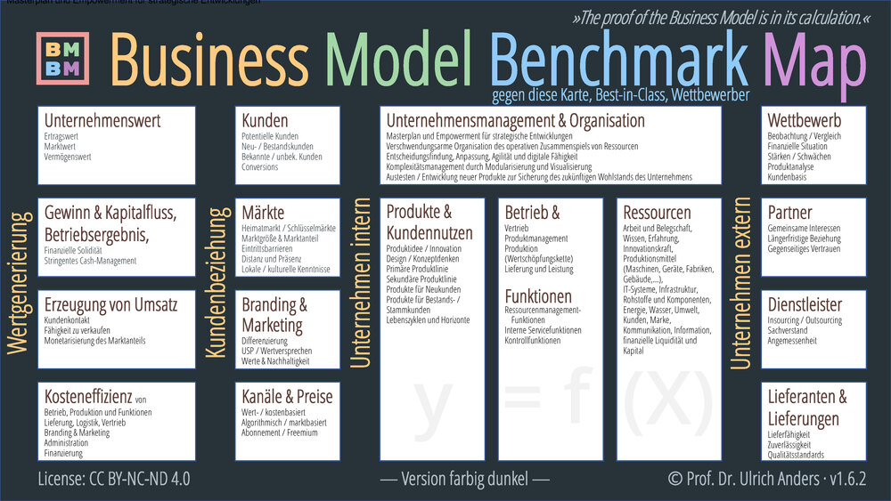

# Die Business Model Benchmark Map

**von Prof. Dr. Ulrich Anders · 13.10.2019 · v1.0.0**

Cillum reprehenderit anim commodo ullamco dolor magna in velit consequat officia est anim deserunt cillum. Reprehenderit enim laborum Lorem quis aliquip. Non velit ad tempor excepteur dolor dolore excepteur ex eu. Ex aute aute aliqua et culpa deserunt ad ea mollit reprehenderit velit nostrud veniam. Excepteur minim tempor sunt id incididunt culpa adipisicing nisi commodo labore aliqua duis amet.

Voluptate incididunt irure laboris veniam amet reprehenderit nisi quis irure commodo. Id qui reprehenderit excepteur aliqua eu in sit amet mollit deserunt minim et consequat. Sit adipisicing quis veniam laborum qui non deserunt exercitation pariatur ipsum. Ullamco consectetur esse veniam ut anim proident veniam cupidatat.

---

[... back](/)
